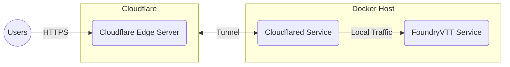

# Foundry VTT running behind a Cloudflare tunnel #

## Notable features of this setup ##

- No NAT or port forwarding required
- TLS and caching provided by Cloudflare
- Certificates are automatically provisioned and updated
- FoundryVTT distributions are cached after download
- FoundryVTT data is stored in the local file system

## Diagram ##



## How to create this setup ##

1. Download this cookbook:

    ```bash
    curl https://codeload.github.com/felddy/foundryvtt-docker/tar.gz/develop | \
    tar xz --strip-components=4 --exclude .gitignore --include '*/cookbooks/cloudflare'
    ```

1. Create the following directory structure:

    ```console
    .
    ├── docker-compose.yml
    ├── foundry_secrets.json
    └── volumes/
        ├── cloudflare_config/
        │   ├── config.yml
        │   └── tunnel_creds.json
        └── foundry_data/
    ```

1. Edit `docker-compose.yml` and `foundry_secrets.json` and replace all the
placeholder values that are contained within `< >`.  For example, modifying the
placeholders for the `foundry` service:

    ```diff
          environment:
    -        - FOUNDRY_HOSTNAME=<vtt.example.com>
    +        - FOUNDRY_HOSTNAME=vtt.mydomain.com
    ```

1. Run the following command to log into Cloudflare:

   ```console
   ➤ cloudflared tunnel login
   ```

1. Create a new Cloudflare tunnel.  You can replace `vtt` with a name of your
   choice for your tunnel:

   ```console
   ➤ cloudflared tunnel create --credentials-file ./volumes/cloudflare_config/tunnel_creds.json vtt
   Tunnel credentials written to ./volumes/cloudflare_config/tunnel_creds.json. Keep this file secret. To revoke these credentials, delete the tunnel.

   Created tunnel vtt with id f57e8992-efe9-4c86-ac37-cf162299533f
   ```

1. Edit the `volumes/cloudflare_config/config.yml` file:
   - Set the `tunnel` key to the id of the new tunnel.  In this example, the id
     is `f57e8992-efe9-4c86-ac37-cf162299533f`.
   - Set the `hostname` key under `ingress` to the hostname your users will use
     to access the server.  In this example, the hostname is `vtt.mydomain.com`.

1. Create a DNS record for the server:

   ```console
   ➤ cloudflared tunnel route dns vtt vtt.mydomain.com
   ```

1. Start the container and detach:

    ```console
    ➤ docker compose up --detach
    ```

1. The FoundryVTT service will now be globally accessible at the hostname you
   specified.  You can access the server by navigating to
   `https://vtt.mydomain.com` in your web browser.
