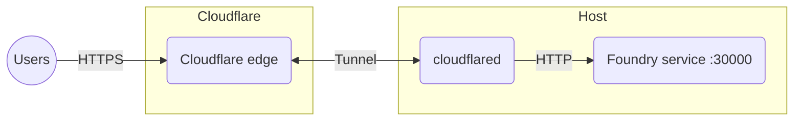

# Foundry VTT behind a Cloudflare Tunnel #

This recipe exposes Foundry to the internet through a [Cloudflare Tunnel].  An
outbound-only `cloudflared` connection means there is no port forwarding or NAT
to configure, and TLS is handled at Cloudflare's edge.

## Notable features ##

- No inbound ports, port forwarding, or NAT rules required.
- TLS and caching provided by Cloudflare; certificates are managed for you.
- Foundry data persists on disk.

## Diagram ##



## Prerequisites ##

- A host with [Docker Compose](../docker-compose.md) (or
  [Podman](../podman.md)).
- A [Cloudflare](https://www.cloudflare.com) account with a domain you manage.
- The [`cloudflared`](https://developers.cloudflare.com/cloudflare-one/connections/connect-networks/downloads/)
  CLI installed locally to create the tunnel.

## How to create this setup ##

1. Create the following layout using the
   [`compose.yaml`](compose.yaml), [`foundry_secrets.json`](foundry_secrets.json),
   and [`volumes/cloudflare_config/config.yml`](volumes/cloudflare_config/config.yml)
   files from this directory:

    ```console
    .
    ├── compose.yaml
    ├── foundry_secrets.json
    └── volumes/
        ├── cloudflare_config/
        │   ├── config.yml
        │   └── tunnel_creds.json   (created below)
        └── foundry_data/
    ```

1. Edit `compose.yaml` and `foundry_secrets.json`, replacing the `< >`
   placeholders with your domain and [foundryvtt.com](https://foundryvtt.com)
   credentials.

1. Log in to Cloudflare:

    ```console
    cloudflared tunnel login
    ```

1. Create a tunnel.  You can replace `vtt` with any name:

    ```console
    cloudflared tunnel create \
      --credentials-file ./volumes/cloudflare_config/tunnel_creds.json vtt
    ```

   Note the tunnel ID printed in the output.

1. Edit `volumes/cloudflare_config/config.yml`:
   - Set `tunnel` to the tunnel ID from the previous step.
   - Set the `ingress` `hostname` to the address your users will visit.

1. Route DNS for that hostname to the tunnel:

    ```console
    cloudflared tunnel route dns vtt vtt.example.com
    ```

1. Start the services and detach:

    ```console
    docker compose up --detach
    ```

1. Foundry is now reachable at your hostname, for example
   `https://vtt.example.com`.

> [!IMPORTANT]
> `tunnel_creds.json` grants control of your tunnel — keep it secret.  This
> recipe's `.gitignore` already excludes it from version control.

[Cloudflare Tunnel]: https://developers.cloudflare.com/cloudflare-one/connections/connect-networks/
