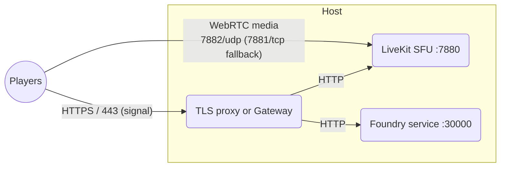
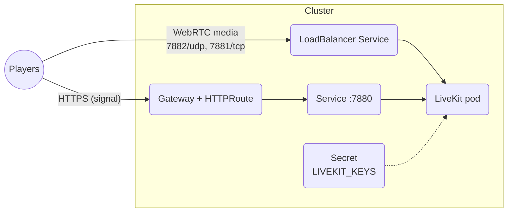

# Audio/video chat with LiveKit #

This recipe runs a [LiveKit] server beside Foundry and replaces the built-in
audio/video chat with the community [LiveKit AVClient] module.

Foundry's built-in A/V is a peer-to-peer mesh: every player streams their
camera to every other player separately, so upload bandwidth per player grows
with the size of the party — with six players, each residential connection
uploads five copies of its video.  LiveKit is a Selective Forwarding Unit
(SFU): each player uploads their stream **once** to your server, which
forwards it to everyone else.  Players' upload needs stay flat no matter the
party size, every player only needs to reach one well-known endpoint, and the
module adds simulcast, per-user quality adaptation, and GM-controlled
breakout rooms on top.

## Notable features ##

- Each player uploads their audio/video once, however large the party.
- Players' networks only need to reach your server — no player-to-player
  connectivity, so one player behind a hostile NAT no longer breaks A/V for
  everyone.
- All WebRTC media multiplexed onto a single UDP port, with a TCP fallback.
- Works with the same [Caddy](../reverse-proxy-caddy/README.md) pattern used
  elsewhere in these guides, or through a cluster Gateway on Kubernetes.

> [!IMPORTANT]
> WebRTC media is UDP and **cannot ride a
> [Cloudflare Tunnel](../cloudflare-tunnel/README.md)**, which only carries
> HTTP.  However you deploy, players' media must reach your server directly:
> plan on forwarding one UDP and one TCP port through your firewall.  A/V
> also requires that Foundry itself is already served over **HTTPS** —
> browsers refuse camera and microphone access on insecure pages.

## Diagram ##



## Prerequisites ##

- Foundry already reachable over HTTPS — for example via the
  [Caddy recipe](../reverse-proxy-caddy/README.md) or a
  [Kubernetes Gateway](../kubernetes/README.md).
- A second DNS hostname for the LiveKit server (for example
  `livekit.example.com`) pointing at the same public address.
- Inbound `7882/udp` and `7881/tcp` forwarded through your firewall to the
  host running LiveKit.
- The [LiveKit AVClient] module (verified with Foundry v13 and v14).

## Deploy with Compose ##

Extends the [Caddy recipe](../reverse-proxy-caddy/README.md) with a LiveKit
service: Caddy terminates TLS for both hostnames, and LiveKit's media ports
are published directly.

### Files ###

| File | Purpose |
| ---- | ------- |
| [`compose.yaml`](compose.yaml) | Foundry, LiveKit, and Caddy in one file. |
| [`Caddyfile`](Caddyfile) | TLS and proxying for both hostnames. |
| [`livekit.yaml`](livekit.yaml) | LiveKit server configuration. |
| [`foundry_secrets.json`](foundry_secrets.json) | Foundry credentials. |

### Steps ###

1. Create the following layout using the files from this directory:

    ```console
    .
    ├── Caddyfile
    ├── compose.yaml
    ├── foundry_secrets.json
    ├── livekit.yaml
    └── volumes/
        └── foundry_data/
    ```

1. Generate an API key/secret pair for LiveKit:

    ```console
    docker run --rm livekit/livekit-server:v1.13.7 generate-keys
    ```

1. Edit the placeholders: the key pair in `livekit.yaml`, your domains in
   `compose.yaml` (`FOUNDRY_HOSTNAME`, `SITE_ADDRESS`, and
   `LIVEKIT_ADDRESS`), and your credentials in `foundry_secrets.json`.

1. Forward `7882/udp` and `7881/tcp` (plus Caddy's `80`/`443`) through your
   firewall to this host.

1. Start the services and detach:

    ```console
    docker compose up --detach
    ```

1. Configure the Foundry module as described
   [below](#configure-the-foundry-module).

### How it works ###

- **Caddy fronts both hostnames.** The LiveKit *signal* connection is an
  ordinary WebSocket, so it is proxied exactly like Foundry itself, and both
  hostnames get automatic HTTPS.  Only the media ports bypass the proxy.

- **One UDP port, not a range.** `udp_port: 7882` multiplexes all WebRTC
  media onto a single port, so publishing (and forwarding) one UDP port
  replaces LiveKit's default `50000–60000` range.

- **`use_external_ip` handles NAT.** LiveKit discovers the host's public IP
  via STUN and advertises it to players, so media finds its way back through
  your port forward.

## Deploy on Kubernetes ##

Runs LiveKit in its own namespace beside the instances from the
[Kubernetes guide](../kubernetes/README.md): the signal API routes through
your cluster's Gateway, and media enters on a `LoadBalancer` Service with a
stable address.  This stage needs a `LoadBalancer` implementation (a cloud
provider's, [MetalLB], Cilium LB-IPAM, or similar).



### Files ###

Everything lives in [`manifests/`](manifests), a ready-to-use [Kustomize]
base:

| File | Resource | Purpose |
| ---- | -------- | ------- |
| [`namespace.yaml`](manifests/namespace.yaml) | `Namespace` | Isolates the server. |
| [`secret.yaml`](manifests/secret.yaml) | `Secret` | The API key/secret pair. |
| [`config/livekit.yaml`](manifests/config/livekit.yaml) | `ConfigMap` (generated) | LiveKit server configuration, as a plain file. |
| [`deployment.yaml`](manifests/deployment.yaml) | `Deployment` | The LiveKit pod. |
| [`service.yaml`](manifests/service.yaml) | `Service` ×2 | Cluster-internal signal endpoint; `LoadBalancer` media entry. |
| [`httproute.yaml`](manifests/httproute.yaml) | `HTTPRoute` | Signal access via the [Gateway API]. |

### Steps ###

1. Generate a key pair and put it in
   [`secret.yaml`](manifests/secret.yaml):

    ```console
    docker run --rm livekit/livekit-server:v1.13.7 generate-keys
    ```

1. Set the hostname in [`httproute.yaml`](manifests/httproute.yaml) and point
   its `parentRefs` at your cluster's `Gateway`.

1. Ensure `7882/udp` and `7881/tcp` can reach the `livekit-media` Service's
   `LoadBalancer` address, and set the advertised address to match in
   [`config/livekit.yaml`](manifests/config/livekit.yaml): behind NAT,
   forward the ports through your firewall and keep `use_external_ip: true`;
   with a directly routable `LoadBalancer` address, set `node_ip` instead.

1. Apply the manifests and watch the rollout:

    ```console
    kubectl apply -k manifests/
    kubectl --namespace livekit rollout status deployment/livekit
    ```

1. Configure the Foundry module as described
   [below](#configure-the-foundry-module).

### How it works ###

- **Media through a `LoadBalancer`, not host networking.** LiveKit's
  traditional self-hosting advice is `hostNetwork: true`, but that hands the
  pod the node's entire network namespace.  A `LoadBalancer` Service gives
  media a stable, dedicated address while the pod stays inside the pod
  network with an ordinary security posture.  The commented alternative
  remains in [`deployment.yaml`](manifests/deployment.yaml) for clusters
  without a `LoadBalancer` implementation.

- **The advertised address must be reachable.** WebRTC clients send media to
  whatever address the server advertises.  Behind NAT, `use_external_ip`
  STUN-discovers the firewall's public IP — correct, because the firewall
  forwards those ports inward.  A directly routable `LoadBalancer` address
  must be advertised explicitly with `node_ip`, because STUN discovery from
  inside a pod would find a node's egress address instead.

- **The signal path stays boring.** The WebSocket API is plain HTTP inside
  the cluster, so it routes through your existing Gateway with TLS at the
  edge — exactly like the Foundry instances themselves.

- **The configuration stays a plain file.** [`config/livekit.yaml`](manifests/config/livekit.yaml)
  is packaged into a `ConfigMap` by the `configMapGenerator` in the
  Kustomization, so editors and linters see native YAML.  The generated name
  carries a content hash and the Deployment's reference is rewritten to
  match, so a config edit rolls the pod automatically on the next apply.

- **Keys live in a Secret.** The configuration deliberately omits the `keys`
  block; the pod receives the pair through the `LIVEKIT_KEYS` environment
  variable so credentials stay out of the configuration.

- **One replica, `Recreate` strategy.** Running several LiveKit instances
  requires a Redis-backed cluster; without one, exactly one instance may
  serve the media Service, so the old pod is stopped before its replacement
  starts.

- **Legacy service links are disabled.** For every Service in a pod's
  namespace, Kubernetes injects Docker-era environment variables — here
  including `LIVEKIT_PORT=tcp://<clusterIP>:7880`, because the Service is
  named `livekit`.  LiveKit reads `LIVEKIT_*` variables as configuration
  overrides, tries to parse that URL as a port number, and crashes at
  startup.  `enableServiceLinks: false` in the Deployment turns off the
  injection; nothing consumes those variables.

## Configure the Foundry module ##

1. Install the [LiveKit AVClient] module in Foundry (search for
   "LiveKit AVClient" in the module installer) and enable it in your world.

1. Open **Configure Settings → Audio/Video Conferencing**, set the
   conferencing mode you want, and under the module's settings choose
   **Custom** as the LiveKit server, then enter:

    - **LiveKit Server Address:** `livekit.example.com` (your hostname — no
      scheme)
    - **LiveKit API Key** and **LiveKit Secret Key:** the generated pair

1. Reload; each player grants camera/microphone access and appears in the
   A/V dock.

> [!NOTE]
> Players on networks that block *all* UDP fall back to WebRTC over TCP on
> `7881`.  If you need to serve players behind networks that block even that,
> LiveKit ships an embedded [TURN server](https://docs.livekit.io/home/self-hosting/server-setup/)
> that relays media over TLS on `443`; it needs its own hostname and
> certificate and is beyond the scope of this recipe.

## Updating ##

The examples pin an exact LiveKit release.  Check the
[LiveKit releases](https://github.com/livekit/livekit/releases) page, update
the image tag, and re-apply — the [LiveKit AVClient] module tracks current
server versions.

[Gateway API]: https://gateway-api.sigs.k8s.io/
[Kustomize]: https://kustomize.io/
[MetalLB]: https://metallb.io/
[LiveKit]: https://github.com/livekit/livekit
[LiveKit AVClient]: https://github.com/bekriebel/fvtt-module-avclient-livekit
