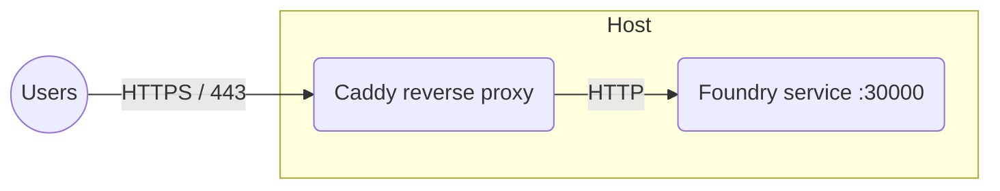

# Foundry VTT behind a Caddy reverse proxy #

This recipe puts Foundry behind [Caddy], which provisions and renews a free TLS
certificate automatically, so the server is reachable over HTTPS with almost no
configuration.

## Notable features ##

- Two services defined in a single Compose file.
- Automatic HTTPS with free, auto-renewing [Let's Encrypt] certificates.
- WebSockets (which Foundry requires) proxied transparently.
- Foundry data and Caddy certificates persist on disk.

## Diagram ##



## Prerequisites ##

- A host with [Docker Compose](../docker-compose.md) (or
  [Podman](../podman.md)).
- A domain name with a DNS `A`/`AAAA` record pointing at the host.
- Inbound TCP `80` and `443` (and UDP `443` for HTTP/3) reachable from the
  internet — Caddy needs them to obtain certificates.

## How to create this setup ##

1. Create the following layout using the
   [`compose.yaml`](compose.yaml), [`Caddyfile`](Caddyfile), and
   [`foundry_secrets.json`](foundry_secrets.json) files from this directory:

    ```console
    .
    ├── Caddyfile
    ├── compose.yaml
    ├── foundry_secrets.json
    └── volumes/
        └── foundry_data/
    ```

1. Edit `compose.yaml` and replace the `<vtt.example.com>` placeholders (in both
   `FOUNDRY_HOSTNAME` and `SITE_ADDRESS`) with your domain.

1. Edit `foundry_secrets.json` and replace the `< >` placeholders with your
   [foundryvtt.com](https://foundryvtt.com) credentials and chosen admin key.

1. Start the services and detach:

    ```console
    docker compose up --detach
    ```

1. Browse to your domain over HTTPS, for example `https://vtt.example.com`.
   Caddy obtains a certificate on first request, which can take a few seconds.

> [!TIP]
> `FOUNDRY_PROXY_SSL=true` tells Foundry it is being served over HTTPS so that
> invitation links and audio/video use the correct protocol.  The container
> `hostname` is fixed so the software license binding survives restarts.

[Caddy]: https://caddyserver.com
[Let's Encrypt]: https://letsencrypt.org
