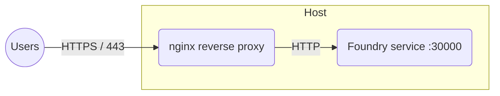

# Foundry VTT behind an nginx reverse proxy #

This recipe puts Foundry behind [nginx] for TLS termination using
**certificates you already have** — from your certificate authority, an
existing [certbot] setup, or wherever your organization keeps them.
Obtaining certificates is out of scope here; if you want fully automatic
HTTPS with zero certificate handling, use the
[Caddy recipe](../reverse-proxy-caddy/README.md) instead.

## Notable features ##

- TLS terminated by nginx with certificates you provide.
- WebSockets (which Foundry requires) proxied with the headers most
  hand-rolled configurations miss.
- Foundry reachable only through nginx — port `30000` is never published on
  the host.
- Based on configurations verified in the project's
  [discussions][discussion-175].

## Diagram ##



## Deploy ##

1. Create the following layout using the [`compose.yaml`](compose.yaml),
   [`nginx/foundry.conf`](nginx/foundry.conf), and
   [`foundry_secrets.json`](foundry_secrets.json) files from this directory,
   and place your certificate and key in `nginx/certs/`:

    ```console
    .
    ├── compose.yaml
    ├── foundry_secrets.json
    ├── nginx/
    │   ├── certs/
    │   │   ├── .gitignore
    │   │   ├── fullchain.pem   (your certificate chain)
    │   │   └── privkey.pem     (your private key)
    │   └── foundry.conf
    └── volumes/
        └── foundry_data/
    ```

1. Edit `compose.yaml` and `nginx/foundry.conf`, replacing the
   `<vtt.example.com>` placeholders with your domain.

1. Edit `foundry_secrets.json` and replace the `< >` placeholders with your
   [foundryvtt.com](https://foundryvtt.com) credentials and chosen admin key.

1. Start the services and detach:

    ```console
    docker compose up --detach
    ```

1. Browse to your domain over HTTPS, for example `https://vtt.example.com`.

> [!IMPORTANT]
> `privkey.pem` is your TLS private key — keep it secret.  This recipe's
> `nginx/certs/.gitignore` keeps the certificate directory out of version
> control if you track your deployment in git.

## How it works ##

- **The WebSocket headers are the part everyone misses.**  Foundry runs over
  WebSockets; without `proxy_http_version 1.1` and the
  `Upgrade`/`Connection "upgrade"` headers, the page background loads and
  everything else silently fails — the most common reverse-proxy problem in
  the project's discussion history.
- `FOUNDRY_PROXY_SSL=true` and `FOUNDRY_PROXY_PORT=443` tell Foundry it is
  served over HTTPS on the standard port, so invitation links and
  audio/video use `https`/`wss` addresses.
- `client_max_body_size 300M` allows large asset and world uploads through
  the proxy.
- The `foundry` service publishes no ports, so it is only reachable through
  nginx on their shared bridge network.  (The network deliberately does not
  use Compose's `internal: true`, which also blocks outbound traffic —
  Foundry needs to reach foundryvtt.com to download releases.)
- The container `hostname` is fixed so the software license binding survives
  restarts.

> [!NOTE]
> Hosting more than one instance under a single domain?  Give each container
> a `FOUNDRY_ROUTE_PREFIX` and add a matching `location` block per prefix —
> see the worked two-instance example in [discussion #175][discussion-175].

[certbot]: https://certbot.eff.org/
[discussion-175]: https://github.com/felddy/foundryvtt-docker/discussions/175
[nginx]: https://nginx.org/
